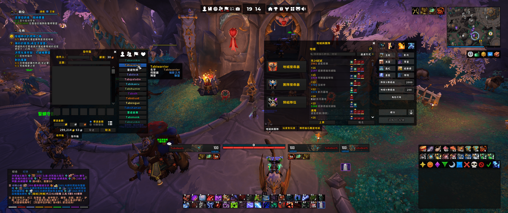

  

[简体中文 (zhCN)](README_zhCN.md) | [繁體中文 (zhTW)](README_zhTW.md) | English (enUS)
  

 

# :white_check_mark: Status

   

Download Sites: [Curse](https://www.curseforge.com/wow/addons/elvui-windtools) | [Wago](https://addons.wago.io/addons/elvui-windtools) | [WowInterface](https://www.wowinterface.com/downloads/info25687-ElvUI_WindTools.html) | [Github Release](https://github.com/fang2hou/ElvUI_WindTools/releases)

# :smiling_face_with_three_hearts: Localization

[ **100% Support** ] 简体中文, 繁體中文, 한국어, ру́сский язы́к, English, Deutsch, français  
[ **Working on Pregress** ] Español, Português, Italiano

# :heart: Credits

- Siweia (NDui)
- Loudsoul (TinyInspect, TinyTooltip)
- Merathilis (ElvUI_MerathilisUI)
- Tox, Nawuko (ElvUI_ToxiUI)

[All credits](CREDITS.md)

# :sweat_drops: Features

## Media Files

3 fonts, 6 textures and 2 ringtones.

## Item

1. **Delete Item**: Enter DELETE automatically; Click to confirm; Delete Key support.
1. **Already Known**: Add a colored overlay to the recipes you have already learned.
1. **Fast Loot**: Make the auto-loot more efficiently.
1. **Trade**: Say thanks to the trade target with one-click.
1. **Extra Item Bar**: Add bars to collect flasks, potions, quest items, and custom items automatically.
1. **Contacts**: Add a contact frame beside the mail frame.
1. **Inspect**: Add an equipment list beside the character panel and inspect frame.
1. **Extended Merchant Pages**: Extend the merchant frame to show more items.

## Combat

1. **Raid Markers**: Add bar contains mark buttons, ready check, pull counter, and more!
1. **Combat Alert**: Show an animation when you enter or leave combat.
1. **Quick Keystone**: Put the keystone from bag automatically.
1. **Class Helper**: Special features for each class. (e.g. DK: Death Strike Estimator)

## Map

1. **Who Clicked?**: Display the name of players who clicked the minimap.
1. **Rectangle Minimap**: Customize the minimap with diffrent length of width and height.
1. **Minimap Buttons**: Collect all the minimap buttons to a bar.
1. **World Map**: Remove the fog of war; scale the world map.
1. **Super Tracker**: Right click to clear waypoint; unlock the distance limitation, etc.
1. **Instance Difficulty**: Reskin the instance difficulty in text style.
1. **Event Tracker**: Track the world events in the world map.

## Quest

1. **Objective Tracker**: Customize the style, size, font of objective tracker.
1. **Turn In**: Turn in the quest automatically; Open follower recruit frame automatically.
1. **Switch Buttons**: Add buttons for switching turn in and announcement module status.
1. **Paragon Reputation**: Show colored reputation bars and rewards after reaching Paragon.

## Social

1. **Chat Bar**: Add a bar contains channel buttons, roll, emote; Custom world channel and custom community channel is also supported.
1. **Chat Link**: Add additional information, icons to the links.
1. **Chat Text**: Change the role icon sets; No brackets in the name; Better abbreviation.
1. **Context Menu**: Add the following buttons to the context menu: guild invite, armory, who.
1. **Emote**: Add support for send and parse emotes.
1. **Friend List**: Add colorful level, faction, area text into friend list.
1. **Smart Tab**: Use Tab to cycle the chat channel; Save the whisper target cross character.

## Announcement

1. **Quest**: Detailed quest progress.
1. **Interrupt**: Send a message after the spell interrupt; Supports pet spells.
1. **Taunt**: Send a message after the taunt spell cast; Supports pets and monk ox statue.
1. **Combat Resurrection**: Alert teammates the usage of combat resurrection spells.
1. **Utility**: Alert the usage of bots, feast, toys, and more.
1. **Threat Transfer**: If someone tries to transfer the threat to the other player, send a message.
1. **Goodbye**: Say goodbye to teammates after the dungeon is completed.
1. **Thanks**: Say thanks for the player who helped you.
1. **Reset Instance**: Alert teammates after instance resetting.

## Tooltip

1. **Icons**: Add the icon of items and spells.
1. **Objective Progress**: Add the additional progress information of mobs.
1. **Group Info**: Add LFG group information into tooltips.
1. **Health Bar**: Set the offset of the health bar and health text in tooltips.
1. **Tier Set**: Add the number of the equipments in the tier set in tooltips.
1. **Progression**: Add the raid progression, special archivements, and mythic+ scores in the inspect tooltip.

## Unit Frames

1. **Quick Focus**: Set focus to mouseover unit by modifier key + click.
1. **Absorb**: Customize the texture of ElvUI absorb bar, and add Blizzard style absorb spark to the end of health bar.
1. **Role Icon**: Change the icon pack of role icons.

## Skins

1. **Vignetting**: Add the shadowed border inner game interface.
1. **Angry Keystones Skin**: Apply skins for Angry Keystones mythic plus timer.
1. **Blizzard Frame Skins**: Additional skins for Blizzard frames.
1. **ElvUI Frame Skins**: Reskin ElvUI modules.
1. **WindTools Skins**: Reskin WindTools modules.
1. **Ace3 Skins**: Apply skin for Ace3-GUI widgets.
1. **Bigwigs Skin**: Apply skin for Bigwigs.
1. **BugSack Skin**: Apply skin for BugSack.
1. **Hekili Skin**: Apply skin for Hekili.
1. **Immersion Skin**: Apply skin for Immersion.
1. **NetEase Meeting Stone Skin**: Apply skin for NetEase Meeting Stone.
1. **Myslot Skin**: Apply skin for Myslot.
1. **Mythic Dungeon Tools Skin**: Apply skin for Mythic Dungeon Tools.
1. **Premade Groups Filter Skin**: Apply skin for Premade Groups Filter.
1. **TinyInspect Skin**: Apply skin for TinyInspect.
1. **TomCat's Tour Skin**: Reskin the tooltip and header of TomCat's Tour.
1. **WarpDeplete Skin**: Reskin the bars in WarpDeplete.
1. **WeakAuras Skin**: Apply skins for WeakAuras, WeakAuras option.
1. **AdiBags Skin**: Apply skin for AdiBags. (AdiBags ElvUI Skin is needed)
1. **Simulationcraft Skin**: Apply skin for Simulationcraft.
1. **RadierIO Skin**: Apply skin for RadierIO.
1. **OmniCD Skin**: Apply skin for OmniCD Config GUI, icons, and status bars.
1. **Autionator Skin**: Apply skin for Auctionator all frames.
1. **Postal Skin**: Apply skin for Postal normal buttons and quick attach buttons.

## Misc

1. **CVars Editor**: Simple editor for changing CVars.
1. **Move Frames**: Move Blizzard frames and ElvUI bags with drag; Supports remember positions.
1. **Transmog**: Add support of saving artifacts in wardrobe outfits.
1. **Mute**: Disable some annoying sound effects.
1. **Pause to Slash**: Convert CJK pause to slash.
1. **Disable Talking Head**: Disable the talking head.
1. **Tags**: Additional tags like range, health text without the sign, class color.
1. **Game Bar**: A system bar in modern style; Support customization.
1. **Skip Cut Scene**: Skip most cut scenes; Press the modified key to stop it temporarily.
1. **LFG List**: Reskin the icons inside LFG group list with a bar in class color.
1. **Move Speed**: Add move speed to the list in character panel.
1. **Automation**: Automatically accept resurrection, summon and hide frames in combat.
1. **Math Without Kanji**: Replace Kanji with latin characters in values.
1. **Auto Screenshot**: Screenshot after you earned an achievement automatically.
1. **Hide Crafter**: Hide crafter name in the item tooltip.
1. **HotKey Above CD**: Show hotkeys above the ElvUI cooldown animation.
1. **Guild News Item Level**: Show item level of each item in guild news.

-----
 

>This repo is for the version of Dragonflight (10.0).  
>Check legacy version here: [ElvUI_WindTools 1.x (BfA)](https://github.com/fang2hou/ElvUI_WindTools_BfA)
